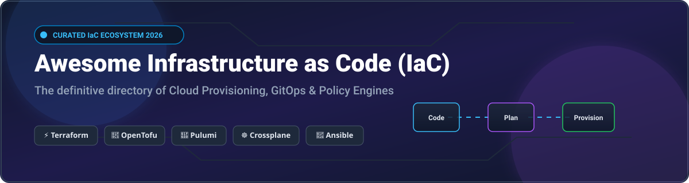

  

# 🚀 Awesome Infrastructure as Code (IaC) 

  
  
  
  
  

## 📌 Top Infrastructure as Code (IaC) Ecosystem & Tools

> 💡 **A Curated List of SaaS Platforms & Open-Source Infrastructure as Code (IaC) GitHub Projects**  
> *Focused on Declarative Provisioning, GitOps Workflows, Cloud Automation, Self-Hosted IaC Platforms & Policy as Code*  
> 📅 **Last updated: October 2026**

---

### 🔍 Overview & Market Insight

This repository tracks notable **commercial IaC SaaS platforms** and **open-source projects** that provision, configure, and manage cloud infrastructure through declarative code — covering multi-cloud provisioning engines, GitOps-driven deployment pipelines, drift detection, state management, and policy-as-code enforcement.

**Key Ecosystem Examples**: AWS CloudFormation, HashiCorp Terraform Cloud, Pulumi, Spacelift, OpenTofu, Crossplane, env0, Scalr, Terragrunt, and SaltStack Cloud.

---

## 📑 Table of Contents

- [☁️ SaaS / Hosted Platforms](#%EF%B8%8F-saashosted-platforms)
- [🔓 Open-Source GitHub Projects](#-open-source-github-projects)
  - [🛠️ Core IaC Engines](#%EF%B8%8F-core-iac-engines)
  - [⚙️ Configuration Management & Machine Images](#%EF%B8%8F-configuration-management--machine-images)
  - [🔀 Orchestration & GitOps Workflow](#-orchestration--gitops-workflow)
  - [🛡️ Policy, Security & Governance](#%EF%B8%8F-policy-security--governance)
  - [⚡ Additional Open-Source IaC Options](#-additional-open-source-iac-options)
- [🤝 How to Contribute](#-how-to-contribute)
- [💖 Support & Community](#-support--community)
- [⚠️ Disclaimer](#%EF%B8%8F-disclaimer)
- [📈 Star History](#-star-history)

---

## ☁️ SaaS/Hosted Platforms

> 📊 **Market Overview**: The global Infrastructure as Code (IaC) market size is estimated at **~$1.2 Billion to $1.8 Billion in 2026**, growing at a ~24% CAGR. The commercial IaC SaaS sector is **moderately fragmented** with a strong leader (AWS CloudFormation & HashiCorp Terraform Cloud) while specialized SaaS orchestration engines (Spacelift, env0, Scalr, Pulumi Cloud) compete aggressively on GitOps features, compliance guardrails, cost management, and developer experience rather than being a single "winner-take-all" market.

| Platform | Description | Valuation / Revenue (Company Size) | Starting Paid Price | Free Tier / Trial Limits |
| :--- | :--- | :--- | :--- | :--- |
| **[AWS CloudFormation](https://aws.amazon.com/cloudformation/)** ☁️ | **AWS's native IaC service** — declarative templates for AWS resource provisioning. Best for AWS-centric organizations. | ~$2.7 Trillion (Amazon Market Cap) | $0 per stack / AWS resource rates ($0.00008/sec for custom handlers >30s) | Free forever for standard AWS resource provisioning |
| **[SaltStack Cloud](https://www.vmware.com/products/aria-automation-configuration.html)** 🧂 | Event-driven infrastructure automation, now part of VMware Aria. | ~$61 Billion (Broadcom / VMware Aria Unit) | Enterprise licensing quote required | Open-source Salt Project free; Enterprise features via VMware quote/trial |
| **[Terraform Cloud](https://www.terraform.io/cloud)** ⚡ | **HashiCorp's managed IaC platform** — remote state, collaboration, policy enforcement, and CI/CD integration. | $7.11 Billion (Acquired by IBM) | $0.10 / managed resource / month (Essentials) | Up to 500 managed resources forever & 1 concurrent run |
| **[Pulumi Cloud](https://www.pulumi.com/)** 🚀 | **Managed IaC with real programming languages** — TypeScript, Python, Go, .NET, Java. | ~$392 Million (Post-money valuation) | $0.00025 / credit / hour (~$40/month estimated team baseline) | Free for 1 individual user & 500 deployment minutes / month |
| **[Spacelift](https://spacelift.io/)** 🛸 | **IaC orchestration platform** — Terraform, OpenTofu, Pulumi, CloudFormation, and Kubernetes. | ~$19.4 Million EST (Private VC-backed) | $20,000 / year (Starter+ Tier) | Free forever for up to 2 users & 1 public worker (14-day free trial for paid tiers) |
| **[env0](https://www.env0.com/)** 🌱 | **IaC automation platform** — self-service environments with guardrails. | ~$8.7 Million EST (Private VC-backed) | Custom quote based on active environments & runs | Free forever up to 250 runs/month & 30 active environments |
| **[Scalr](https://scalr.com/)** ⚖️ | **Terraform automation and collaboration** — policy enforcement and cost management. | ~$5.3 Million EST (Private VC-backed) | $0.99 / qualifying run (Pay-as-you-go) | Free forever for up to 50 qualifying runs / month |

---

## 🔓 Open-Source GitHub Projects

### 🛠️ Core IaC Engines

- **[Ansible](https://github.com/ansible/ansible)**   
  🤖 **The standard for configuration management & provisioning**, GPL-3.0 licensed. **Agentless automation for systems, networks, and cloud resources**. **Best for configuration automation and node setup**.

- **[Terraform](https://github.com/hashicorp/terraform)**   
  ⚡ **The de facto IaC provisioning standard**, BUSL-1.1 licensed. **Declarative multi-cloud configuration** — AWS, Azure, GCP, and 3,000+ providers. **Best for multi-cloud declarative infrastructure as code**.

- **[OpenTofu](https://github.com/opentofu/opentofu)**   
  🧅 **Truly open-source Terraform fork**, MPL-2.0 licensed. **Community-driven under Linux Foundation**. **Drop-in replacement for Terraform with open governance**.

- **[Pulumi](https://github.com/pulumi/pulumi)**   
  🚀 **IaC with real programming languages**, Apache-2.0 licensed. **TypeScript, Python, Go, .NET, Java, YAML**. **Full programming language expressiveness with loops, functions, and testing**.

- **[Crossplane](https://github.com/crossplane/crossplane)**   
  ☸️ **Kubernetes-native cloud resource management**, Apache-2.0 licensed. **Extends Kubernetes API via CRDs to provision cloud infrastructure**. **Best for internal developer platforms (IDPs)**.

---

### ⚙️ Configuration Management & Machine Images

- **[Packer](https://github.com/hashicorp/packer)**   
  📦 **Automated machine image builder**, BUSL-1.1 licensed. **Builds identical golden images for AWS AMI, Docker, VMware, and GCP**.

- **[SaltStack](https://github.com/saltstack/salt)**   
  🧂 **Event-driven infrastructure automation**, Apache-2.0 licensed. **High-speed remote execution and state enforcement at enterprise scale**.

- **[Chef](https://github.com/chef/chef)**   
  👨‍🍳 **Policy-driven infrastructure automation**, Apache-2.0 licensed. **Code-driven continuous deployment and configuration auditing**.

- **[Puppet](https://github.com/puppetlabs/puppet)**   
  🏽 **Agent-based configuration management**, Apache-2.0 licensed. **Declarative state enforcement and infrastructure compliance**.

- **[Vagrant](https://github.com/hashicorp/vagrant)**   
  🧱 **Development environment automation**, BUSL-1.1 licensed. **Creates lightweight, reproducible local VM environments**.

---

### 🔀 Orchestration & GitOps Workflow

- **[Argo CD](https://github.com/argoproj/argo-cd)**   
  🐙 **Declarative GitOps continuous delivery tool for Kubernetes**, Apache-2.0 licensed. **Automates application & cluster resource state syncing**.

- **[Flux CD](https://github.com/fluxcd/flux2)**   
  🔄 **Open & flexible GitOps toolkit for Kubernetes**, Apache-2.0 licensed. **Syncs cluster state with Git & OCI repositories**.

- **[Infracost](https://github.com/infracost/infracost)**   
  💰 **Cloud cost estimation for Terraform**, Apache-2.0 licensed. **Displays real-time cloud cost estimates inside Git Pull Requests**.

- **[Terragrunt](https://github.com/gruntwork-io/terragrunt)**   
  🚜 **DRY Terraform orchestration wrapper**, MIT licensed. **Keeps configurations DRY and manages multi-account Terraform state dependencies**.

- **[Atlantis](https://github.com/runatlantis/atlantis)**   
  🏛️ **Terraform Pull Request Automation**, Apache-2.0 licensed. **Runs terraform plan and apply directly via PR comments**.

- **[Terramate](https://github.com/terramate-io/terramate)**   
  🤹 **Code generation & stack orchestration for IaC**, MPL-2.0 licensed. **Adds change detection, stack isolation, and parallel execution to Terraform**.

- **[Digger](https://github.com/diggerhq/digger)**   
  ⛏️ **Open-source GitOps IaC orchestrator for CI/CD**, MIT licensed. **Runs Terraform/OpenTofu directly inside your existing GitHub Actions/GitLab CI**.

- **[Spacelift Agent](https://github.com/spacelift-io/spacelift-agent)**   
  🛸 **Self-hosted agent runner for Spacelift IaC platform**, Apache-2.0 licensed.

---

### 🛡️ Policy, Security & Governance

- **[Trivy](https://github.com/aquasecurity/trivy)**   
  🎯 **Comprehensive security scanner for IaC & containers**, Apache-2.0 licensed. **Scans IaC files, container images, code repositories, and Kubernetes**.

- **[Open Policy Agent (OPA)](https://github.com/open-policy-agent/opa)**   
  🛡️ **General-purpose policy-as-code engine**, Apache-2.0 licensed. **Unified policy enforcement across cloud, Kubernetes, Terraform, and CI/CD pipelines**.

- **[Checkov](https://github.com/bridgecrewio/checkov)**   
  🔍 **Static IaC security & compliance scanner**, Apache-2.0 licensed. **Scans Terraform, CloudFormation, Kubernetes, Helm, and ARM templates for security misconfigurations**.

- **[tfsec](https://github.com/aquasecurity/tfsec)**   
  🔒 **Lightweight Terraform static security scanner**, MIT licensed. **Fast offline detection of Terraform security risks and bad practices**.

---

### ⚡ Additional Open-Source IaC Options

- **[Nix](https://github.com/NixOS/nix)**  — Purely functional package manager and reproducible system configuration management.
- **[NixOS](https://github.com/NixOS/nixos-hardware)**  — Linux distribution built on Nix with declarative system configuration.
- **[Cloud-init](https://github.com/canonical/cloud-init)**  — Multi-distribution industry standard for early cloud instance bootstrapping.
- **[Ignition](https://github.com/coreos/ignition)**  — First-boot provisioning utility used by Fedora CoreOS & Flatcar Container Linux.
- **[KubeVirt](https://github.com/kubevirt/kubevirt)**  — Virtual machine management technology for running legacy VMs natively inside Kubernetes.

---

## 🤝 How to Contribute

We welcome community contributions! To add a new platform, tool, or updates:

1. Fork this repository 🍴
2. Create your feature branch (`git checkout -b feature/add-new-iac-tool`)
3. Add or edit entries in `README.md` following our standard structure and formatting
4. Ensure your description is concise, factual, and includes official documentation links
5. Open a Pull Request with a clear title and context 🚀

---

## 💖 Support & Community

Thank you for exploring and using this curated Infrastructure as Code repository! If this resource helps your DevOps or platform engineering workflow:

- ⭐ **Star this repository** to show support and help others discover it!
- 🔀 **Fork it** to maintain your custom collection or contribute improvements back.
- 📢 **Share it** with your DevOps team, platform engineering group, and tech community.
- ☕ **Buy Me a Coffee / Sponsor**: Support ongoing maintenance and updates via [GitHub Sponsors](https://github.com/sponsors/ishandutta2007).

---

## ⚠️ Disclaimer

- This directory is a **community-curated list** — it is not exhaustive and does not constitute an official endorsement.
- **State Management & Security**: IaC state files contain sensitive credentials and infrastructure secrets. Always secure state backends (S3, GCS, Azure Blob) with encryption, access controls, and locking mechanisms. Never commit raw state files to Git repositories.
- **Licensing Considerations**: Verify project licenses before adoption (e.g. Terraform BUSL-1.1 vs. OpenTofu MPL-2.0 vs. Pulumi/Crossplane Apache-2.0).

---

## 📈 Star History

